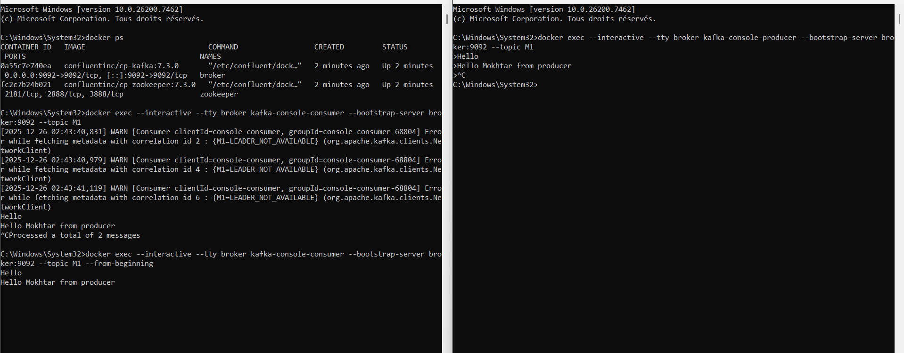
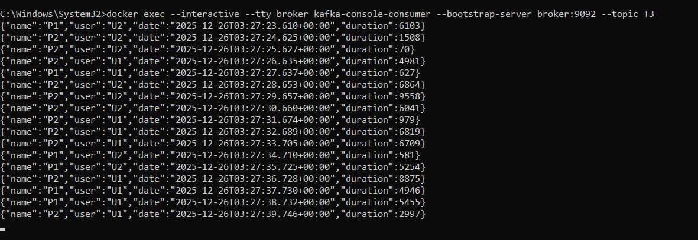
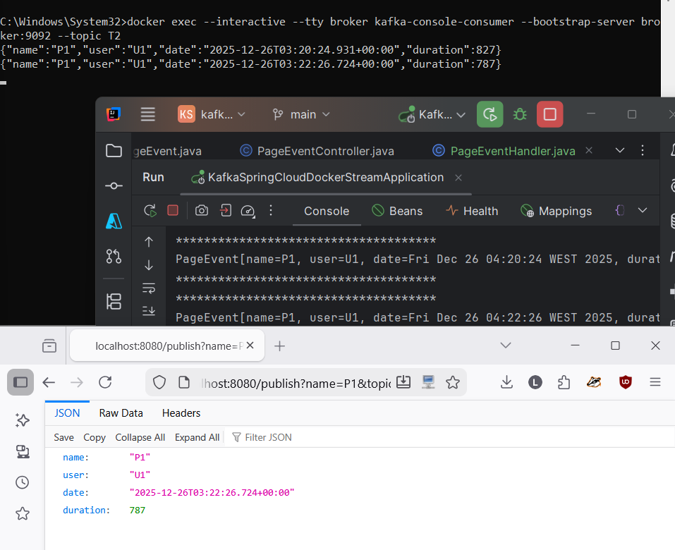
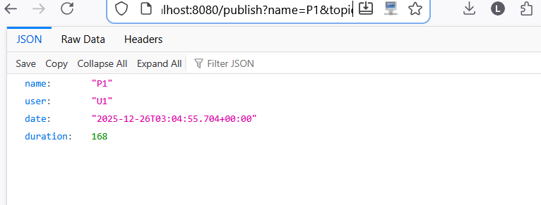
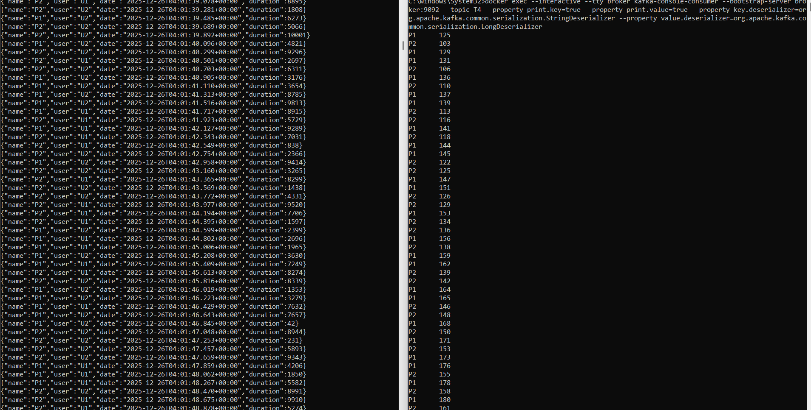
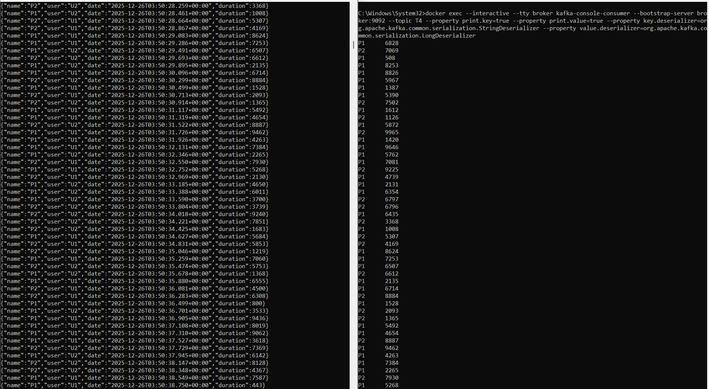
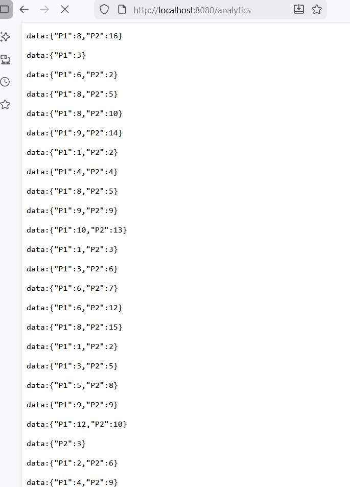
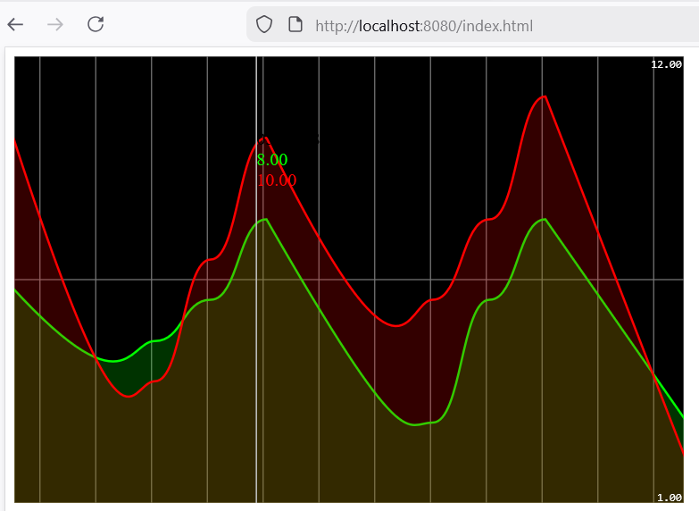

# 📊 Kafka Spring Cloud Stream - Real-Time Data Analytics

<div align="center">


**Application de traitement de flux de données en temps réel avec Apache Kafka et Spring Cloud Stream**

</div>

---

## 📋 Table des Matières

- [📖 À Propos du Projet](#-à-propos-du-projet)
- [🏗️ Architecture du Système](#️-architecture-du-système)
- [🔧 Technologies Utilisées](#-technologies-utilisées)
- [📂 Structure du Projet](#-structure-du-projet)
- [🚀 Démarrage Rapide](#-démarrage-rapide)
- [⚙️ Configuration](#️-configuration)
- [📸 Captures d'Écran & Démonstrations](#-captures-décran--démonstrations)
- [📡 API Endpoints](#-api-endpoints)
- [📚 Ressources Pédagogiques](#-ressources-pédagogiques)
- [👤 Auteur](#-auteur)

---

## 📖 À Propos du Projet

Ce projet académique implémente une **application de traitement de flux de données en temps réel** utilisant **Apache Kafka** et **Spring Cloud Stream**. L'application démontre les différents patterns de messaging et le traitement analytique en temps réel.

### Fonctionnalités Principales

- 📤 **Producer REST** : Publication de messages via API REST
- 📥 **Consumer Kafka** : Consommation et affichage des messages
- ⚡ **Supplier Automatique** : Génération automatique d'événements
- 📊 **Stream Processing** : Analyse en temps réel avec Kafka Streams
- 📈 **Dashboard Temps Réel** : Visualisation des analytics avec Smoothie.js
- 🪟 **Windowed Aggregation** : Agrégation par fenêtre temporelle

### Objectifs Pédagogiques

Ce projet a été réalisé dans le cadre du cours **J2EE** sous la supervision du **Prof. Mohamed YOUSSFI**, permettant d'acquérir des compétences sur :

- ✅ Architecture Event-Driven avec Apache Kafka
- ✅ Spring Cloud Stream pour le messaging
- ✅ Kafka Streams API pour le traitement de flux
- ✅ Patterns Producer/Consumer/Supplier
- ✅ Windowed Aggregations et State Stores
- ✅ Interactive Queries pour requêter les stores
- ✅ Server-Sent Events (SSE) pour le temps réel
- ✅ Docker Compose pour Kafka et Zookeeper

---

## 🏗️ Architecture du Système

```
┌──────────────────────────────────────────────────────────────────────────┐
│                    ARCHITECTURE KAFKA SPRING CLOUD STREAM                │
├──────────────────────────────────────────────────────────────────────────┤
│                                                                          │
│    ┌─────────────────┐                                                   │
│    │   REST Client   │──────────────────┐                                │
│    │   /publish      │                  │                                │
│    └─────────────────┘                  │                                │
│                                         ▼                                │
│    ┌─────────────────┐         ┌─────────────────┐                       │
│    │  Web Dashboard  │◀────────│  Spring Boot    │                       │
│    │  (Smoothie.js)  │   SSE   │   Application   │                       │
│    └─────────────────┘         └────────┬────────┘                       │
│                                         │                                │
│         ┌───────────────────────────────┼───────────────────────────┐    │
│         │                               │                           │    │
│         ▼                               ▼                           ▼    │
│    ┌─────────┐                   ┌─────────────┐              ┌─────────┐│
│    │ Producer│                   │  Supplier   │              │Consumer ││
│    │ (REST)  │                   │ (Auto 200ms)│              │ (Log)   ││
│    └────┬────┘                   └──────┬──────┘              └────▲────┘│
│         │                               │                          │     │
│         ▼                               ▼                          │     │
│    ┌─────────────────────────────────────────────────────────────────┐   │
│    │                        APACHE KAFKA                             │   │
│    │  ┌─────────┐    ┌─────────┐    ┌─────────┐    ┌─────────┐      │   │
│    │  │ Topic   │    │ Topic   │    │ Topic   │    │ Topic   │      │   │
│    │  │   T1    │    │   T2    │◀───│   T3    │───▶│   T4    │      │   │
│    │  └─────────┘    └────▲────┘    └────┬────┘    └─────────┘      │   │
│    │                      │              │                          │   │
│    └──────────────────────│──────────────│──────────────────────────┘   │
│                           │              │                               │
│                           │              ▼                               │
│                      ┌────│────────────────────────┐                     │
│                      │    │   KAFKA STREAMS        │                     │
│                      │    └── Filter → Map → Group │                     │
│                      │        → Window → Count     │                     │
│                      │        → State Store        │                     │
│                      └─────────────────────────────┘                     │
│                                                                          │
│    ┌─────────────────┐         ┌─────────────────┐                       │
│    │    Zookeeper    │◀───────▶│  Kafka Broker   │                       │
│    │     :2181       │         │     :9092       │                       │
│    └─────────────────┘         └─────────────────┘                       │
│                                                                          │
└──────────────────────────────────────────────────────────────────────────┘
```

### Flux de Données

```
┌─────────────┐     ┌─────────────┐     ┌─────────────┐     ┌─────────────┐
│  Supplier   │────▶│   Topic T3  │────▶│   Kafka     │────▶│   Topic T4  │
│  (PageEvent)│     │             │     │   Streams   │     │  (Counts)   │
└─────────────┘     └─────────────┘     └─────────────┘     └─────────────┘
                                              │
                                              │ Windowed
                                              │ Aggregation
                                              ▼
                                    ┌─────────────────┐
                                    │  State Store    │
                                    │  "count-store"  │
                                    └────────┬────────┘
                                             │
                                             │ Interactive
                                             │ Query
                                             ▼
                                    ┌─────────────────┐
                                    │   /analytics    │
                                    │   (SSE Stream)  │
                                    └────────┬────────┘
                                             │
                                             ▼
                                    ┌─────────────────┐
                                    │  Web Dashboard  │
                                    │  (Real-time)    │
                                    └─────────────────┘
```

### Topics Kafka

| Topic | Rôle | Producteur | Consommateur |
|-------|------|------------|--------------|
| **T1** | Topic de test manuel | REST API | Console |
| **T2** | Événements consommés | Externe | `pageEventConsumer` |
| **T3** | Événements générés | `pageEventSupplier` | `kStream` |
| **T4** | Résultats analytics | `kStream` | Dashboard |

---

## 🔧 Technologies Utilisées

### Backend & Messaging
| Technologie | Version | Description |
|-------------|---------|-------------|
| **Java** | 21 (LTS) | Langage de programmation principal |
| **Spring Boot** | 3.5.9 | Framework de développement |
| **Spring Cloud Stream** | 2025.0.1 | Abstraction messaging |
| **Spring Kafka** | - | Intégration Kafka native |

### Apache Kafka Ecosystem
| Technologie | Version | Description |
|-------------|---------|-------------|
| **Apache Kafka** | 7.3.0 | Plateforme de streaming distribuée |
| **Kafka Streams** | - | API de traitement de flux |
| **Zookeeper** | 7.3.0 | Coordination du cluster |
| **Confluent Platform** | 7.3.0 | Images Docker officielles |

### Frontend & Visualisation
| Technologie | Description |
|-------------|-------------|
| **Smoothie.js** | Librairie de graphiques temps réel |
| **Server-Sent Events** | Streaming côté client |
| **HTML5 Canvas** | Rendu graphique |

### Infrastructure
| Technologie | Description |
|-------------|-------------|
| **Docker** | Containerisation |
| **Docker Compose** | Orchestration Kafka + Zookeeper |
| **Lombok** | Réduction du boilerplate code |

---

## 📂 Structure du Projet

```
kafka-spring-cloud-docker-stream/
│
├── 📁 src/
│   ├── 📁 main/
│   │   ├── 📁 java/ma/lahjaily/
│   │   │   ├── 📄 KafkaSpringCloudDockerStreamApplication.java  # Point d'entrée
│   │   │   │
│   │   │   ├── 📁 entities/
│   │   │   │   └── 📄 PageEvent.java          # Record des événements de page
│   │   │   │
│   │   │   ├── 📁 controllers/
│   │   │   │   └── 📄 PageEventController.java # REST API + SSE Analytics
│   │   │   │
│   │   │   └── 📁 handlers/
│   │   │       └── 📄 PageEventHandler.java   # Consumer, Supplier, KStream
│   │   │
│   │   └── 📁 resources/
│   │       ├── 📄 application.properties      # Configuration Spring Cloud Stream
│   │       └── 📁 static/
│   │           └── 📄 index.html              # Dashboard temps réel
│   │
│   └── 📁 test/                               # Tests unitaires
│
├── 📁 captures/                               # Screenshots documentation
├── 📄 docker-compose.yml                      # Kafka + Zookeeper
├── 📄 pom.xml                                 # Dépendances Maven
└── 📄 README.md
```

---

## 🚀 Démarrage Rapide

### Prérequis

| Outil | Version | Vérification |
|-------|---------|--------------|
| ☕ **Java JDK** | 21+ | `java -version` |
| 📦 **Maven** | 3.8+ | `mvn -version` |
| 🐋 **Docker Desktop** | Latest | `docker --version` |
| 🧠 **RAM** | 4 GB+ | Recommandé pour Kafka |

### Étape 1 : Démarrer Kafka avec Docker Compose

```bash
# Cloner le repository
git clone https://github.com/MokhtarLahjaily/kafka-spring-cloud-docker-stream.git
cd kafka-spring-cloud-docker-stream

# Démarrer Zookeeper et Kafka
docker-compose up -d

# Vérifier le statut des containers
docker-compose ps
```

### Étape 2 : Démarrer l'Application Spring Boot

```bash
# Compiler et lancer l'application
./mvnw spring-boot:run

# Ou avec Maven installé
mvn spring-boot:run
```

### Étape 3 : Tester l'Application

| Action | URL/Commande | Description |
|--------|--------------|-------------|
| **Dashboard** | http://localhost:8080 | Visualisation temps réel |
| **Publier événement** | http://localhost:8080/publish?name=P1&topic=T2 | Test Producer |
| **Analytics SSE** | http://localhost:8080/analytics | Flux SSE brut |

### Test avec Kafka Console (Optionnel)

```bash
# Créer un topic
docker exec -it broker kafka-topics --create --topic T1 --bootstrap-server localhost:9092

# Producer console
docker exec -it broker kafka-console-producer --topic T1 --bootstrap-server localhost:9092

# Consumer console (nouveau terminal)
docker exec -it broker kafka-console-consumer --topic T1 --from-beginning --bootstrap-server localhost:9092
```

---

## ⚙️ Configuration

### Configuration Spring Cloud Stream

```properties
# application.properties
spring.application.name=kafka-spring-cloud-docker-stream
server.port=8080

# Consumer - Écoute sur T2
spring.cloud.stream.bindings.pageEventConsumer-in-0.destination=T2

# Supplier - Publie sur T3 toutes les 200ms
spring.cloud.stream.bindings.pageEventSupplier-out-0.destination=T3
spring.cloud.stream.bindings.pageEventSupplier-out-0.producer.poller.fixed-delay=200

# Kafka Streams - T3 → Processing → T4
spring.cloud.stream.bindings.kStream-in-0.destination=T3
spring.cloud.stream.bindings.kStream-out-0.destination=T4

# Commit interval pour Kafka Streams
spring.cloud.stream.kafka.streams.binder.configuration.commit.interval.ms=1000

# Fonctions actives
spring.cloud.function.definition=pageEventConsumer;pageEventSupplier;kStream
```

### Docker Compose - Kafka & Zookeeper

```yaml
version: '3'
services:
  zookeeper:
    image: confluentinc/cp-zookeeper:7.3.0
    container_name: zookeeper
    environment:
      ZOOKEEPER_CLIENT_PORT: 2181
      ZOOKEEPER_TICK_TIME: 2000
      
  broker:
    image: confluentinc/cp-kafka:7.3.0
    container_name: broker
    ports:
      - "9092:9092"
    depends_on:
      - zookeeper
    environment:
      KAFKA_BROKER_ID: 1
      KAFKA_ZOOKEEPER_CONNECT: 'zookeeper:2181'
      KAFKA_LISTENER_SECURITY_PROTOCOL_MAP: PLAINTEXT:PLAINTEXT,PLAINTEXT_INTERNAL:PLAINTEXT
      KAFKA_ADVERTISED_LISTENERS: PLAINTEXT://localhost:9092,PLAINTEXT_INTERNAL://broker:29092
      KAFKA_OFFSETS_TOPIC_REPLICATION_FACTOR: 1
```

---

## 📸 Captures d'Écran & Démonstrations

### 1️⃣ Test Kafka Console - Producer to Consumer



> **📸 Figure 1** : Test de communication Kafka via les outils console. Le `kafka-console-producer` envoie des messages qui sont reçus par le `kafka-console-consumer`, confirmant le bon fonctionnement du broker Kafka.

---

### 2️⃣ Test Spring Kafka Producer



> **📸 Figure 2** : Test du Producer Spring Kafka. L'application envoie des événements `PageEvent` sur les topics Kafka configurés via le `StreamBridge`.

---

### 3️⃣ Test Spring Kafka Consumer



> **📸 Figure 3** : Logs du Consumer Spring Kafka affichant les événements reçus. Chaque `PageEvent` est affiché avec son nom, utilisateur, date et durée dans la console.

---

### 4️⃣ Producer REST Controller - Test API



> **📸 Figure 4** : Test de l'endpoint REST `/publish` pour envoyer un événement manuellement. Le `StreamBridge` publie le message sur le topic spécifié et retourne le `PageEvent` créé.

---

### 5️⃣ KStream - Traitement des Visites



> **📸 Figure 5** : Visualisation du traitement Kafka Streams. Les événements sont filtrés, mappés, groupés et agrégés par fenêtre temporelle de 5 secondes dans le State Store "count-store".

---

### 6️⃣ Test KStream Analytics



> **📸 Figure 6** : Test du pipeline Kafka Streams complet. Les agrégations windowed sont calculées en temps réel et stockées pour les Interactive Queries.

---

### 7️⃣ Endpoint Analytics - Flux SSE



> **📸 Figure 7** : Flux SSE brut de l'endpoint `/analytics`. Les données sont envoyées au client chaque seconde avec les comptages par page (P1, P2) au format JSON.

---

### 8️⃣ Dashboard Analytics - Visualisation Frontend



> **📸 Figure 8** : Dashboard temps réel affichant les métriques avec Smoothie.js. Le graphique montre le comptage des pages P1 (vert) et P2 (rouge) avec des courbes animées en temps réel.

---

## 📡 API Endpoints

### REST Controller

| Méthode | Endpoint | Description | Paramètres |
|---------|----------|-------------|------------|
| `GET` | `/publish` | Publier un événement | `name`, `topic` |
| `GET` | `/analytics` | Flux SSE des analytics | - |

### Exemples d'Utilisation

```bash
# Publier un événement sur le topic T2
curl "http://localhost:8080/publish?name=HomePage&topic=T2"

# Publier sur le topic T3 (traité par Kafka Streams)
curl "http://localhost:8080/publish?name=P1&topic=T3"

# Observer le flux analytics (SSE)
curl -N "http://localhost:8080/analytics"
```

### Format des Données

#### PageEvent (Record)
```java
public record PageEvent(
    String name,      // Nom de la page (P1, P2, ...)
    String user,      // Utilisateur (U1, U2)
    Date date,        // Timestamp
    long duration     // Durée en ms
) {}
```

#### Analytics Response (SSE)
```json
{
  "P1": 42,
  "P2": 38
}
```

---

## 🔍 Détails Techniques

### Pattern Consumer (pageEventConsumer)

Consomme les messages du topic T2 et les affiche dans la console :

```java
@Bean
public Consumer<PageEvent> pageEventConsumer() {
    return (input) -> {
        System.out.println("*************************************");
        System.out.println(input.toString());
        System.out.println("*************************************");
    };
}
```

### Pattern Supplier (pageEventSupplier)

Génère automatiquement des événements toutes les 200ms :

```java
@Bean
public Supplier<PageEvent> pageEventSupplier() {
    return () -> new PageEvent(
        Math.random() > 0.5 ? "P1" : "P2",
        Math.random() > 0.5 ? "U1" : "U2",
        new Date(),
        10 + new Random().nextInt(10000)
    );
}
```

### Pattern Kafka Streams (kStream)

Traitement en temps réel avec agrégation windowed :

```java
@Bean
public Function<KStream<String, PageEvent>, KStream<String, Long>> kStream() {
    return (input) -> input
        .filter((k, v) -> v.duration() > 100)           // Filtrer durée > 100ms
        .map((k, v) -> new KeyValue<>(v.name(), v.duration()))
        .groupByKey(Grouped.with(Serdes.String(), Serdes.Long()))
        .windowedBy(TimeWindows.of(Duration.ofSeconds(5)))  // Fenêtre 5s
        .count(Materialized.as("count-store"))          // State Store
        .toStream()
        .map((k, v) -> new KeyValue<>(k.key(), v));
}
```

### Interactive Query Service

Interrogation du State Store pour les analytics :

```java
@GetMapping(path = "/analytics", produces = MediaType.TEXT_EVENT_STREAM_VALUE)
public Flux<Map<String, Long>> analytics() {
    return Flux.interval(Duration.ofSeconds(1))
        .map(sequence -> {
            Map<String, Long> result = new HashMap<>();
            ReadOnlyWindowStore<String, Long> store = 
                interactiveQueryService.getQueryableStore("count-store", 
                    QueryableStoreTypes.windowStore());
            // Fetch last 5 seconds
            KeyValueIterator<Windowed<String>, Long> iterator = 
                store.fetchAll(Instant.now().minusMillis(5000), Instant.now());
            while (iterator.hasNext()) {
                KeyValue<Windowed<String>, Long> next = iterator.next();
                result.put(next.key.key(), next.value);
            }
            return result;
        });
}
```

---

## 📚 Ressources Pédagogiques

### Vidéo de Référence

| Titre | Lien | Description |
|-------|------|-------------|
| **Kafka Spring Cloud Stream** | [YouTube](https://www.youtube.com/watch?v=8uY7JE_X_Fw) | Tutoriel complet par Prof. YOUSSFI |

### Repository de Référence

| Ressource | Lien |
|-----------|------|
| **Code Source Original** | [GitHub - mohamedYoussfi/kafka-spring-cloud-stream](https://github.com/mohamedYoussfi/kafka-spring-cloud-stream) |

### Documentation Officielle

| Ressource | Lien |
|-----------|------|
| **Spring Cloud Stream** | [spring.io/projects/spring-cloud-stream](https://spring.io/projects/spring-cloud-stream) |
| **Apache Kafka** | [kafka.apache.org/documentation](https://kafka.apache.org/documentation/) |
| **Kafka Streams** | [kafka.apache.org/documentation/streams](https://kafka.apache.org/documentation/streams/) |
| **Confluent Platform** | [docs.confluent.io](https://docs.confluent.io/) |

### Concepts Clés

| Concept | Description |
|---------|-------------|
| **Event-Driven Architecture** | Architecture basée sur les événements |
| **Stream Processing** | Traitement continu des flux de données |
| **Windowed Aggregation** | Agrégation par fenêtre temporelle |
| **State Store** | Stockage d'état pour les agrégations |
| **Interactive Queries** | Requêtes sur les State Stores |
| **SSE (Server-Sent Events)** | Streaming unidirectionnel serveur → client |

---

## 👤 Auteur

<div align="center">

**Mokhtar LAHJAILY**

Étudiant en 5ème année Ingénierie Informatique et Réseaux (5IIR)  
École Marocaine des Sciences de l'Ingénieur (EMSI)

[](https://github.com/MokhtarLahjaily)

</div>

---

## 📄 Licence

Ce projet est réalisé dans un cadre académique sous la supervision du **Prof. Mohamed YOUSSFI**.

---

<div align="center">

**🎓 Projet Académique - Module J2EE - EMSI**

**Année Universitaire 2025/2026**

</div>
